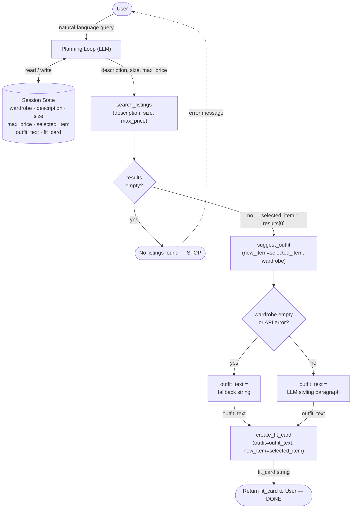

# FitFindr — planning.md

> Complete this document before writing any implementation code.
> Your spec and agent diagram are what you'll use to direct AI tools (Claude, Copilot, etc.) to generate your implementation — the more specific they are, the more useful the generated code will be.
> Your planning.md will be reviewed as part of your submission.
> Update it before starting any stretch features.

---

## Tools

List every tool your agent will use. For each tool, fill in all four fields.
You must have at least 3 tools. The three required tools are listed — add any additional tools below them.

### Tool 1: search_listings

**What it does:**
Filters the 40 mock listings from `data/listings.json` to only those whose title, description, or style tags match the user's description keyword, whose size field matches the user's size exactly, and whose price is at or below max_price — then returns the matching listings.

**Input parameters:**
- `description` (str): Natural-language phrase describing what the user wants — e.g., `"vintage graphic tee"` or `"cozy oversized jacket"`. Used to match against each listing's `title`, `description`, and `style_tags`.
- `size` (str): The user's clothing size exactly as it appears in the listings — e.g., `"M"`, `"S/M"`, `"W30 L30"`, `"One Size"`. Used to filter out listings whose `size` field does not match.
- `max_price` (float): The upper price limit in US dollars (e.g., `30.0`). Excludes any listing whose `price` field is above this value.

**What it returns:**
A list of up to 5 listing dicts, each containing:
- `id` (str) — unique listing identifier, e.g. `"lst_007"`
- `title` (str) — short listing title, e.g. `"Vintage Levi's 501 Jeans — Medium Wash"`
- `description` (str) — seller's longer description
- `category` (str) — one of: `tops`, `bottoms`, `outerwear`, `shoes`, `accessories`
- `style_tags` (list[str]) — style descriptors, e.g. `["vintage", "streetwear", "denim"]`
- `size` (str) — the listing's size field
- `condition` (str) — one of: `excellent`, `good`, `fair`
- `price` (float) — asking price in dollars
- `colors` (list[str]) — colors present in the item, e.g. `["blue", "indigo"]`
- `brand` (str or None) — brand name if known, otherwise `null`
- `platform` (str) — one of: `depop`, `thredUp`, `poshmark`

**What happens if it fails or returns nothing:**
If the filtered list is empty, the tool returns `[]`. The agent then tells the user no listings matched their criteria and asks them to adjust — specifically, whether to broaden the size (e.g., accept `"S/M"` instead of just `"S"`) or raise the price limit. The agent does not call `suggest_outfit` or `create_fit_card` until at least one result is found.

---

### Tool 2: suggest_outfit

**What it does:**
Sends the new listing item and the user's existing wardrobe to the Groq LLM and asks it to suggest which wardrobe pieces pair well with the new item, explaining the styling reasoning (color harmony, style-tag overlap, category balance).

**Input parameters:**
- `new_item` (dict): One listing dict from the output of `search_listings` — must contain at least `title`, `category`, `style_tags`, `colors`, and `description`. This is the item the user is considering buying.
- `wardrobe` (dict): A wardrobe dict with a single key `"items"` whose value is a list of wardrobe-item dicts. Each wardrobe item has: `id` (str), `name` (str), `category` (str), `colors` (list[str]), `style_tags` (list[str]), and `notes` (str or None). Pass `get_example_wardrobe()` for testing; pass `get_empty_wardrobe()` when the user has no wardrobe.

**What it returns:**
A plain-text string — one to three short paragraphs — naming specific wardrobe items by `name` and explaining why they work with the new item. Example: `"The vintage black denim jacket (w_006) pairs well here because it shares the same grunge/streetwear tags as the flannel..."`. The string is passed directly to `create_fit_card`.

**What happens if it fails or returns nothing:**
If `wardrobe["items"]` is an empty list, the tool skips the LLM call and returns the string `"No wardrobe items provided — styling the new piece on its own."` The agent still proceeds to `create_fit_card` with this fallback string rather than stopping. If the Groq API call raises an exception, the tool catches it and returns `"Outfit suggestion unavailable."` so the agent can still produce a fit card.

---

### Tool 3: create_fit_card

**What it does:**
Formats the chosen listing and the outfit suggestion into a structured, human-readable "fit card" — the final output block shown to the user summarizing the item and how to style it.

**Input parameters:**
- `outfit` (str): The styling paragraph(s) returned by `suggest_outfit`. May be the fallback string `"No wardrobe items provided..."` or `"Outfit suggestion unavailable."` — the tool handles both gracefully.
- `new_item` (dict): The listing dict for the item being recommended — must contain `title`, `price`, `platform`, `condition`, `size`, `colors`, and `style_tags`. These populate the structured fields of the card.

**What it returns:**
A formatted multi-line string ready to display to the user. The card always follows this structure:
```
🛍️  <title>
Price:     $<price>
Platform:  <platform>
Condition: <condition>
Size:      <size>
Colors:    <colors joined by ", ">
Style:     <style_tags joined by ", ">

Outfit idea:
<outfit>
```

**What happens if it fails or returns nothing:**
If `new_item` is missing any of the required display fields, the tool substitutes `"N/A"` for that field rather than raising an error, so the card is always produced. If `outfit` is an empty string, the card omits the "Outfit idea" section entirely and adds a note: `"No outfit suggestion available."` The agent always returns the fit card as its final response — there is no case where it produces no output.

---

### Additional Tools (if any)

<!-- Copy the block above for any tools beyond the required three -->

---

## Planning Loop

**How does your agent decide which tool to call next?**

The tool call order is always fixed: `search_listings` → `suggest_outfit` → `create_fit_card`. The planning loop does not choose between tools dynamically — it always runs them in this sequence, but it checks the output of each step before continuing.

**Step 1 — Parse the user query.**
The LLM reads the user's natural-language message and extracts three values: a `description` keyword phrase, a `size` string, and a `max_price` float. If any of the three cannot be extracted (e.g., the user didn't mention a size), the loop asks the user a follow-up question and waits — it does not call any tool yet.

**Step 2 — Call `search_listings(description, size, max_price)`.**
After the call, check the returned list:
- If the list is empty → set `error = "No listings found for your criteria."`, return the error message to the user, and stop. Do not proceed to Step 3.
- If the list is non-empty → set `selected_item = results[0]` (the first returned match) and proceed to Step 3.

**Step 3 — Call `suggest_outfit(selected_item, wardrobe)`.**
`wardrobe` comes from session state (either the example wardrobe loaded at startup or an empty wardrobe if none was provided). After the call, check the returned string:
- If the string is `"Outfit suggestion unavailable."` (API error) or `"No wardrobe items provided..."` (empty wardrobe) → store it as `outfit_text` anyway and proceed to Step 4. Do not stop.
- Otherwise → set `outfit_text = result` and proceed to Step 4.

**Step 4 — Call `create_fit_card(outfit_text, selected_item)`.**
This call always succeeds (the tool handles missing fields internally). Set `fit_card = result` and return it to the user. The loop is done.

---

## State Management

**How does information from one tool get passed to the next?**

The agent holds a session state dict that is initialized at startup and updated after each tool call. No tool reads from the previous tool directly — each tool only reads from its own parameters, and the planning loop is responsible for pulling values out of state and passing them in.

**Session state variables:**

| Variable | Type | Set when | Used by |
|---|---|---|---|
| `wardrobe` | dict | Startup, before any user query | `suggest_outfit` |
| `description` | str | After parsing the user query | `search_listings` |
| `size` | str | After parsing the user query | `search_listings` |
| `max_price` | float | After parsing the user query | `search_listings` |
| `selected_item` | dict | After `search_listings` returns a non-empty list | `suggest_outfit`, `create_fit_card` |
| `outfit_text` | str | After `suggest_outfit` returns | `create_fit_card` |
| `fit_card` | str | After `create_fit_card` returns | Returned to user |

**How each handoff works:**

- `wardrobe` is loaded once at startup using `get_example_wardrobe()` and stored in session state. It is never modified during a query — the same wardrobe dict is passed to every `suggest_outfit` call in the session.
- After the LLM parses the user query, `description`, `size`, and `max_price` are written into session state. The planning loop then reads all three out of state and passes them as arguments to `search_listings`.
- `search_listings` returns a list. The planning loop reads `results[0]` from that list and writes it into `session["selected_item"]`. Nothing else is stored from the search results — only the top match.
- The planning loop passes `session["selected_item"]` as `new_item` and `session["wardrobe"]` as `wardrobe` when calling `suggest_outfit`. The returned string is written into `session["outfit_text"]`.
- The planning loop passes `session["outfit_text"]` as `outfit` and `session["selected_item"]` as `new_item` when calling `create_fit_card`. The returned string is written into `session["fit_card"]` and immediately returned to the user.

**State resets between queries:** At the start of each new user query, `description`, `size`, `max_price`, `selected_item`, `outfit_text`, and `fit_card` are all cleared. `wardrobe` is not cleared — it persists for the entire session.

---

## Error Handling

For each tool, describe the specific failure mode you're handling and what the agent does in response.

| Tool | Failure mode | Agent response |
|------|-------------|----------------|
| search_listings | `search_listings` returns `[]` | Do not call `suggest_outfit` or `create_fit_card`. Return to the user: `"No listings matched '[description]' in size [size] under $[max_price]. Want to try a broader keyword (e.g. 'tee' instead of 'vintage graphic tee'), a different size, or a higher price limit?"` — quoting back the exact values that were searched so the user knows what was tried and what to change. |
| suggest_outfit | `wardrobe["items"]` is `[]` | Skip the Groq API call entirely. Set `outfit_text = "No wardrobe on file — add some items to your wardrobe to get outfit suggestions."` Pass this string to `create_fit_card` as normal. The user receives a complete fit card with this message in the Outfit idea section. The agent does not stop or ask a follow-up question. |
| suggest_outfit | Groq API raises an exception (timeout, invalid key, rate limit) | Catch the exception — do not surface the error message or traceback to the user. Set `outfit_text = "Outfit suggestion unavailable right now."` Pass this string to `create_fit_card` as normal. The user receives a complete fit card with this message in the Outfit idea section. |
| create_fit_card | `new_item` is missing one or more display fields, or `outfit` is an empty string | For each missing field in `new_item`, substitute `"N/A"` in that line of the card. If `outfit` is an empty string, print `"No outfit suggestion available."` in place of the Outfit idea section. The user always sees a complete, formatted card — no error message and no blank lines. |

---

## Architecture



---

## AI Tool Plan

<!-- For each part of the implementation below, describe:
     - Which AI tool you plan to use (Claude, Copilot, ChatGPT, etc.)
     - What you'll give it as input (which sections of this planning.md, your agent diagram)
     - What you expect it to produce
     - How you'll verify the output matches your spec before moving on

     "I'll use AI to help me code" is not a plan.
     "I'll give Claude my Tool 1 spec (inputs, return value, failure mode) and ask it to implement
     search_listings() using load_listings() from the data loader — then test it against 3 queries
     before trusting it" is a plan. -->

**Milestone 3 — Individual tool implementations:**

**Tool 1 — `search_listings`:**
I'll give Claude the Tool 1 block from planning.md (what it does, all three input parameters with types and meanings, the full return value field list, and the empty-results failure mode). I'll ask it to implement `search_listings(description, size, max_price)` in `tools.py` using `load_listings()` from `utils/data_loader.py`. I expect it to produce a function that filters listings by checking if `description` appears in `title`, `description`, or `style_tags`; matches `size` exactly; and excludes items where `price > max_price`, returning up to 5 results as a list of dicts. Before running it, I'll read the generated code and confirm it checks all three filters and returns `[]` (not raises an error) when nothing matches. Then I'll test it with three queries: one that should return results, one with a price so low nothing qualifies, and one with a size that doesn't exist in the data.

**Tool 2 — `suggest_outfit`:**
I'll give Claude the Tool 2 block from planning.md (both input parameter descriptions, the return value format, and both failure modes) plus the wardrobe schema from `data/wardrobe_schema.json` so it knows the exact shape of the wardrobe dict. I'll ask it to implement `suggest_outfit(new_item, wardrobe)` in `tools.py` using the Groq SDK with the `GROQ_API_KEY` from `.env`. I expect it to produce a function that skips the API call when `wardrobe["items"]` is empty (returning the fallback string), catches any Groq exception and returns the error fallback string, and otherwise sends a prompt containing the new item's title/style_tags/colors and the wardrobe item names/style_tags to the LLM and returns the response text. Before running it, I'll check that both fallback branches are present and that the prompt actually includes the wardrobe item names (not just the raw dict). I'll test it with the example wardrobe, with an empty wardrobe, and with an intentionally bad API key to trigger the error fallback.

**Tool 3 — `create_fit_card`:**
I'll give Claude the Tool 3 block from planning.md (both input parameter descriptions, the exact card format with all field names, and the two failure modes for missing fields and empty outfit string). I'll ask it to implement `create_fit_card(outfit, new_item)` in `tools.py` with no external calls — pure string formatting only. I expect it to produce a function that builds the card template field by field, substitutes `"N/A"` for any key missing from `new_item`, and replaces the "Outfit idea" section with `"No outfit suggestion available."` when `outfit` is an empty string. Before running it, I'll check that the output matches the exact card layout from the spec (field labels, line breaks, section headers). I'll test it with a complete `new_item` dict, with a dict missing the `brand` and `platform` keys, and with `outfit=""`.

---

**Milestone 4 — Planning loop and state management:**

I'll give Claude the Planning Loop section, the State Management section, and the Mermaid architecture diagram from planning.md all at once. I'll ask it to implement the main agent loop in a new file (e.g., `agent.py`) that: initializes session state with `get_example_wardrobe()`, extracts `description`/`size`/`max_price` from the user's message using the Groq LLM, calls the three tools in order, checks `results == []` after `search_listings` and returns early with the error message if so, stores `results[0]` as `selected_item`, and passes session variables as arguments to each subsequent tool. I expect it to produce a function like `run_agent(user_query, session)` that returns either an error string or a fit card string. Before running it, I'll read the code and verify: (1) the early-exit branch after `search_listings` is present, (2) `selected_item` is set to `results[0]` not the full list, (3) `wardrobe` comes from session state not re-loaded inside the loop, and (4) `outfit_text` is always passed to `create_fit_card` even when it's a fallback string. I'll test it end-to-end with a query that matches results, a query that matches nothing (to confirm early exit), and a query run with an empty wardrobe (to confirm the fallback flows through to the fit card).

---

## A Complete Interaction (Step by Step)

Write out what a full user interaction looks like from start to finish — tool call by tool call. Use a specific example query.

**Example user query:** "I'm looking for a vintage graphic tee under $30. I mostly wear baggy jeans and chunky sneakers. What's out there and how would I style it?"

**Step 1 — Parse query and call `search_listings`:**
The Planning Loop reads the query and extracts `description = "vintage graphic tee"` and `max_price = 30.0`. Size is not mentioned in the query, so the agent asks: "What's your clothing size?" The user replies: "S/M". The agent writes `size = "S/M"` to session state and calls `search_listings("vintage graphic tee", "S/M", 30.0)`. The function scans all 40 listings, finds `lst_002` ("Y2K Baby Tee — Butterfly Print") whose `style_tags` include `"vintage"` and `"graphic tee"`, whose `size` is `"S/M"`, and whose `price` is `$18.00` — all three filters pass. It returns a list containing that listing dict. The planning loop sets `selected_item = results[0]` (the lst_002 dict) and writes it to session state.

**Step 2 — Call `suggest_outfit`:**
The Planning Loop calls `suggest_outfit(new_item=selected_item, wardrobe=session["wardrobe"])`. `selected_item` is the lst_002 dict (title: "Y2K Baby Tee — Butterfly Print", style_tags: ["y2k", "vintage", "graphic tee", "cottagecore"], colors: ["white", "pink", "purple"]). `wardrobe` is the example wardrobe loaded at startup with 10 items. The wardrobe is not empty, so the function sends a prompt to the Groq LLM with the item details and the wardrobe item names and style tags. The LLM returns a paragraph like: "The baggy straight-leg jeans (w_001) are a natural fit — the dark wash denim grounds the pastel butterfly print without competing with it. Add the chunky white sneakers (w_007) to keep the look in the y2k/streetwear lane, and the black crossbody bag (w_010) for a minimal accent that won't distract from the tee." The planning loop writes this string to `session["outfit_text"]`.

**Step 3 — Call `create_fit_card`:**
The Planning Loop calls `create_fit_card(outfit=session["outfit_text"], new_item=selected_item)`. The function reads each display field from the lst_002 dict and formats the card. All fields are present so no `"N/A"` substitutions are needed. `outfit` is a non-empty string so the "Outfit idea" section is included. The function returns the formatted card string and the planning loop writes it to `session["fit_card"]` and returns it to the user.

**Final output to user:**
```
🛍️  Y2K Baby Tee — Butterfly Print
Price:     $18.0
Platform:  depop
Condition: excellent
Size:      S/M
Colors:    white, pink, purple
Style:     y2k, vintage, graphic tee, cottagecore

Outfit idea:
The baggy straight-leg jeans (w_001) are a natural fit — the dark wash denim
grounds the pastel butterfly print without competing with it. Add the chunky
white sneakers (w_007) to keep the look in the y2k/streetwear lane, and the
black crossbody bag (w_010) for a minimal accent that won't distract from the tee.
```
